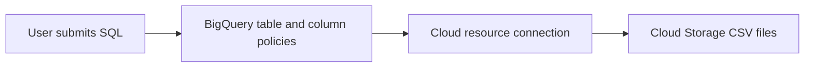

# Cloud Storage Data Lake through BigQuery
Create and view a connection resource.
Set up access to a Cloud Storage data lake.
Create a Lakehouse table.
Query a Lakehouse table through BigQuery.
Set up access control policies.
Upgrade external tables to Lakehouse tables.

Activate Cloud Shell
```bash
gcloud auth list
gcloud config list project
```


## Task 1. Create a connection resource
Lakehouse tables access Google Cloud Storage data using a connection resource. A connection resource can be associated with a single table or an arbitrary group of tables in the project.

From the Navigation Menu, go to BigQuery > Studio. Click Done.

To create a connection, switch to Explorer tab and click + Add data. Then use the search bar for data sources to search for Agent Platform. Click on the result for Agent Platform.

In the Access external data in place, select BigQuery Federation.

In the Connection type list, select Agent Platform remote models, remote functions, Lakehouse and Spanner (Cloud Resource).

In the Connection ID field, type my-connection.

For Location type, choose Multi-region and select US (multiple regions in United States) from dropdown.

Click Create connection.

To view your connection information, select the connection in the navigation menu.

In the connection info section, copy the service account ID, you will need this in the following section.

YOUR_CONNECTION_SERVICE_ACCOUNT

## Task 2. Set up access to a Cloud Storage data lake
In this section, you will give the new connection resource read-only access to the Cloud Storage data lake so that BigQuery can access Cloud Storage files on behalf of users. We recommend that you grant the connection resource service account the Storage Object Viewer IAM role, which lets the service account access Cloud Storage buckets.

From the Navigation Menu, go to IAM & Admin > IAM.

Click +Grant access.

In the New principals field, enter the service account ID that you copied earlier.

In the Select a role field, select Cloud Storage, and then select Storage Object Viewer.


Click Save.

Note: After you migrate users to Lakehouse tables, remove direct Cloud Storage permissions from existing users. Direct file access allows users to bypass governance policies (such as row- and column-level security) set on Lakehouse tables.

## Task 3. Create a Lakehouse table
The following example uses the CSV file format, but you can use any format supported by Lakehouse, as shown in Limitations. If you're familiar with creating tables in BigQuery, then this process should be similar. The only difference is that you specify the associated cloud resource connection.

Note: For optimal performance, we recommend using Cloud Storage single-region or dual-region buckets and not multi-region buckets.
If no schema was provided and the service account was not granted access to the bucket in the previous step, this step will fail with an access denied message.

Create a dataset
Navigate back to BigQuery > Studio.

Switch to Classic Explorer and click the three dots next to your project name, then select Create dataset.


For the Dataset ID, type demo_dataset.

For Location type, choose Multi-region and select US (multiple regions in United States) from dropdown.

Leave the rest of the fields as default and click Create dataset.

Now define an external table over the Cloud Storage CSV. The source files remain in Cloud Storage; this does not load a native BigQuery copy.

Create the table
Click on three dots next to demo_dataset, then choose Create table.

For Create table from, select Google Cloud Storage from the dropdown.
Note: A Cloud Storage bucket has been created with two datasets that you will use in this lab.
Click Browse to select the dataset. Navigate to the bucket named YOUR_PROJECT_ID and then click customer.csv file to import it into BigQuery, and click Select.

For Destination, verify your lab project has been selected and you're using the demo_dataset.

For the table name, type biglake_table.

Set the table type to External Table.

Select the box to Create a Lakehouse table using a Cloud Resource connection.

Verify that your connection ID us.my-connection is selected. Your configuration should resemble the following:

For Schema, enable Edit as text and copy and paste the following schema into the text box:
```json
[
{
    "name": "customer_id",
    "type": "INTEGER",
    "mode": "REQUIRED"
  },
  {
    "name": "first_name",
    "type": "STRING",
    "mode": "REQUIRED"
  },
  {
    "name": "last_name",
    "type": "STRING",
    "mode": "REQUIRED"
  },
  {
    "name": "company",
    "type": "STRING",
    "mode": "NULLABLE"
  },
  {
    "name": "address",
    "type": "STRING",
    "mode": "NULLABLE"
  },
  {
    "name": "city",
    "type": "STRING",
    "mode": "NULLABLE"
  },
  {
    "name": "state",
    "type": "STRING",
    "mode": "NULLABLE"
  },
  {
    "name": "country",
    "type": "STRING",
    "mode": "NULLABLE"
  },
  {
    "name": "postal_code",
    "type": "STRING",
    "mode": "NULLABLE"
  },
  {
    "name": "phone",
    "type": "STRING",
    "mode": "NULLABLE"
  },
  {
    "name": "fax",
    "type": "STRING",
    "mode": "NULLABLE"
  },
  {
    "name": "email",
    "type": "STRING",
    "mode": "REQUIRED"
  },
  {
    "name": "support_rep_id",
    "type": "INTEGER",
    "mode": "NULLABLE"
  }
]
```
Note: Typically data lakes do not have a predefined schema. For this lab's purposes, we are using one to make setting column-level policies clearer.
Click Create Table.

## Task 4. Query a Lakehouse table through BigQuery
Now that you've created the Lakehouse table, you can use any BigQuery client to submit a query.

Click on the biglake_table from demo_dataset.

From the biglake_table preview toolbar, click Query.

Run the following to query the Lakehouse table through the BigQuery Editor:

```sql
SELECT * FROM `YOUR_PROJECT_ID.demo_dataset.biglake_table`
;
```
Click Run.

Verify you can see all of the columns and data in the resulting table.

## Task 5. Set up access control policies
Once a Lakehouse table has been created, it can be managed in a similar fashion to BigQuery tables. To create access control policies for Lakehouse tables, you'll first create a taxonomy of policy tags in BigQuery. Then, apply the policy tags to the sensitive rows or columns. In this section, you will create a column level policy. For directions on setting up row-level security, see the row-level security guide.

For these purposes, a BigQuery taxonomy named YOUR_LAB_TAXONOMY and an associated policy tag named biglake-policy has been created for you.

Add policy tags to columns
You will now use the policy tag you created to restrict access to certain columns within the BigQuery table. For this example, you will restrict access to sensitive information such as address, postal code, and phone number.

From the Navigation Menu, go to BigQuery > Studio.

Navigate to demo_dataset > biglake_table and click the table to open the table schema page.

Click Edit schema.

Check the boxes next to the address, postal_code, and phone fields.

Click Add policy tag.

Click YOUR_LAB_TAXONOMY to expand it to select biglake-policy. and then save.


Verify the column level security
Open the query editor for the biglake_table.

Run the following to query the Lakehouse table through the BigQuery Editor:

```sql
SELECT * FROM `YOUR_PROJECT_ID.demo_dataset.biglake_table`
;
```
Click Run.

You should receive an error access denied error:

Access Denied: BigQuery BigQuery: User has neither fine-grained reader nor masked get permission to get data protected by policy tag "YOUR_LAB_TAXONOMY : biglake-policy" on columns YOUR_PROJECT_ID.demo_dataset.biglake_table.address, YOUR_PROJECT_ID.demo_dataset.biglake_table.phone, YOUR_PROJECT_ID.demo_dataset.biglake_table.postal_code.

Now, run the following query, omitting the columns you don't have access to:

```sql
SELECT *  EXCEPT(address, phone, postal_code)
FROM `YOUR_PROJECT_ID.demo_dataset.biglake_table`
;
```

## Task 6. Upgrade external tables to Lakehouse tables
You can upgrade existing tables to Lakehouse tables by associating the existing table to a cloud resource connection. For a complete list of flags and arguments, see bq update and bq mkdef.

Create the external table
Click three dots next to demo_dataset, then choose Create table.

For Create table from, choose Google Cloud Storage from the dropdown.

Click Browse to select the dataset. Navigate to the bucket named YOUR_PROJECT_ID and then click invoice.csv file to import it into BigQuery, and click Select.

For Destination, verify your lab project has been selected and you're using the demo_dataset.

For the table name, use external_table.

Set the table type to External Table.

Note: Do not specify a Cloud Resource connection yet.
For Schema, enable Edit as text and copy and paste the following schema into the text box:
```json
[
{
    "name": "invoice_id",
    "type": "INTEGER",
    "mode": "REQUIRED"
  },
  {
    "name": "customer_id",
    "type": "INTEGER",
    "mode": "REQUIRED"
  },
  {
    "name": "invoice_date",
    "type": "TIMESTAMP",
    "mode": "REQUIRED"
  },
  {
    "name": "billing_address",
    "type": "STRING",
    "mode": "NULLABLE"
  },
  {
    "name": "billing_city",
    "type": "STRING",
    "mode": "NULLABLE"
  },
  {
    "name": "billing_state",
    "type": "STRING",
    "mode": "NULLABLE"
  },
  {
    "name": "billing_country",
    "type": "STRING",
    "mode": "NULLABLE"
  },
  {
    "name": "billing_postal_code",
    "type": "STRING",
    "mode": "NULLABLE"
  },
  {
    "name": "total",
    "type": "NUMERIC",
    "mode": "REQUIRED"
  }
]
```
Click Create Table.


Update external table to Lakehouse table
Open a new Cloud Shell window and run the following command to generate a new external table definition that specifies the connection to use:
```bash
export PROJECT_ID=$(gcloud config get-value project)
bq mkdef \
--autodetect \
--connection_id=$PROJECT_ID.US.my-connection \
--source_format=CSV \
"gs://$PROJECT_ID/invoice.csv" > /tmp/tabledef.json
```
Verify your table definition has been created:
```bash
cat /tmp/tabledef.json
```
Get the schema from your table:
```bash
bq show --schema --format=prettyjson  demo_dataset.external_table > /tmp/schema
```
Update the table using the new external table definition:
```bash
bq update --external_table_definition=/tmp/tabledef.json --schema=/tmp/schema demo_dataset.external_table
```
Click Check my progress to verify the objective.

YOUR_CONNECTION_SERVICE_ACCOUNT


Verify the updated table
From the Navigation Menu, go to BigQuery > Studio.

Navigate to demo_dataset > and click external_table.

Open the Details tab.

Verify under External Data Configuration that the table is now using the proper Connection ID.


Great! You successfully upgraded the existing external table to a Lakehouse table by associating it to a cloud resource connection.

## Study guide: understand the architecture

The lab notes use the term Lakehouse. Google’s documentation describes these connection-backed Cloud Storage tables as BigLake tables. This exercise queries CSV files, rather than creating an Iceberg table.



| Component | Purpose in this lab |
| --- | --- |
| Cloud Storage bucket | Stores `customer.csv` and `invoice.csv`. |
| Connection `my-connection` | Provides the service account used to access the source files. |
| Dataset `demo_dataset` | Contains BigQuery table definitions. |
| Table `biglake_table` | Exposes customer records through the connection. |
| Taxonomy and policy tag | Restrict access to selected customer columns. |
| Table `external_table` | Starts without a connection and is upgraded to use one. |

Access delegation separates permission to query a BigLake table from access to the underlying storage. Associating an existing external table with a connection upgrades it to a BigLake table. See [Google’s creation and upgrade guide](https://docs.cloud.google.com/bigquery/docs/create-cloud-storage-table-biglake).

### Settings and placeholders

- Connection ID: `my-connection`, shown as `us.my-connection` in the lab UI.
- Connection and dataset location: `US` multi-region.
- Dataset ID: `demo_dataset` (underscore).
- Customer table: `biglake_table`.
- Invoice table: `external_table`.
- Source bucket: use the actual bucket provided by your current lab.
- `YOUR_PROJECT_ID`: replace in SQL with the active project ID.
- `YOUR_CONNECTION_SERVICE_ACCOUNT`: copy from your connection details.
- `YOUR_LAB_TAXONOMY`: use the taxonomy supplied in your current lab; `biglake-policy` is its policy tag.

The upgrade command assumes the bucket name equals `$PROJECT_ID`. If your bucket has another name, replace its Cloud Storage URI. Keep the dataset, connection, and bucket locations compatible. Console labels may differ from those recorded in the original lab.

## Understand the schemas

The complete customer and invoice JSON schemas are retained in Tasks 3 and 6 above.

- `INTEGER` fields store whole-number identifiers.
- `STRING` fields store text, including phone and postal codes whose formatting matters.
- `TIMESTAMP` represents the invoice date/time.
- `NUMERIC` represents the invoice total.
- `REQUIRED` fields must have a value; `NULLABLE` fields allow missing values.

An explicit schema tells BigQuery how to interpret CSV columns. Check source column order and CSV header handling when creating the table. The source notes do not specify a header-row setting, so inspect the actual files rather than assuming a value.

## Understand column-level access control

Task 5 tags `address`, `postal_code`, and `phone`. The lab expects an access error when the querying identity lacks permission for those tagged fields. A user who already has the necessary policy access may still be able to query them.

`SELECT * EXCEPT(address, phone, postal_code)` omits the protected columns; it does not mask them or grant additional access. Policy tags govern columns, whereas row-level policies govern records. Direct access to the underlying CSV can bypass the table’s restrictions, which is why the notes discuss removing unnecessary direct storage access after migration.

See [Google’s column-level access control overview](https://docs.cloud.google.com/bigquery/docs/column-level-security-intro).

## Understand the upgrade commands

| Command | Purpose |
| --- | --- |
| `gcloud config get-value project` | Read the active project into the shell variable. |
| `bq mkdef` | Generate an external table definition containing the source format, URI, and connection. |
| `cat /tmp/tabledef.json` | Inspect the generated definition. |
| `bq show --schema --format=prettyjson` | Save the existing invoice schema before updating the table. |
| `bq update --external_table_definition ... --schema ...` | Apply the connection-backed definition with the saved schema. |

These are Cloud Shell Bash commands. Run them in order, check each command for errors, and confirm the project and source URI first. The update changes table metadata; it does not copy the invoice CSV into a native BigQuery table.

## Verification checklist

- [ ] Connection exists in `US`, and its service account is recorded.
- [ ] The connection account can read the lab’s Cloud Storage objects.
- [ ] `demo_dataset` exists in `US`.
- [ ] `biglake_table` points at `customer.csv` through the intended connection.
- [ ] The customer query returns records before restricting columns.
- [ ] Policy tags are applied to all three intended columns.
- [ ] An identity without policy access receives an error for protected fields.
- [ ] The query excluding protected columns succeeds with otherwise sufficient permissions.
- [ ] `external_table` points at `invoice.csv`.
- [ ] After the upgrade, its Details tab shows the intended connection ID.

Exact row counts and customer/invoice values were not supplied in the notes. Record your observed results rather than expecting an invented sample output.

## Troubleshooting

| Symptom | Checks |
| --- | --- |
| Cannot read the source CSV | Correct URI, object existence, and connection service account permissions. |
| Location mismatch | Dataset and connection location, plus bucket location compatibility. |
| CSV parsing error | File format, column order, explicit schema, and header handling. |
| Protected-column query fails | Expected for a principal without access to the tagged columns; try the provided `EXCEPT` query. |
| Protected-column query unexpectedly succeeds | Check whether the querying identity already has policy access and whether the tags were saved. |
| Upgrade command fails | Active project, connection ID, bucket URI, saved schema, and existing table name. |
| Connection missing after upgrade | Inspect command output and the table’s External Data Configuration. |

## Review questions and answers

1. **Where are the records stored?** In the Cloud Storage CSV files; BigQuery holds external table definitions.
2. **Which identity reads the objects through the connection?** The connection’s service account.
3. **What distinguishes the upgraded table?** Its external definition is associated with a Cloud resource connection.
4. **Why exclude three columns in Task 5?** To query permitted fields without requesting protected ones.
5. **Does `EXCEPT` delete columns?** No; it only changes the query’s selected columns.
6. **Why save the schema before upgrading?** To supply the existing schema when applying the new definition.
7. **Why avoid copying old service account IDs?** They refer to a specific connection/project and may be wrong for a new lab.

## Sources and scope

All six lab tasks, both schemas, queries, and shell commands are organized from the original `text.txt`, which is retained unchanged. Temporary project/account/taxonomy identifiers are replaced with reusable placeholders in this guide. Explanations, checkpoints, and review questions are added study aids; the linked Google documentation supports access delegation, table upgrades, and column-level security. No cloud resources were changed and no queries were executed while preparing this guide.
