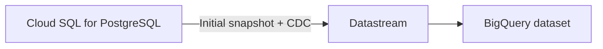

# Datastream: PostgreSQL Replication to BigQuery

A hands-on Google Cloud lab that uses Datastream to replicate PostgreSQL data and change events into BigQuery.

## Lab goals

- Create a Cloud SQL for PostgreSQL source database.
- Load sample records and configure PostgreSQL logical replication.
- Create Datastream connection profiles for PostgreSQL and BigQuery.
- Start a Datastream stream and verify both the initial snapshot and later changes in BigQuery.

## Architecture



## Requirements

- A Google Cloud project with billing enabled and permission to create Cloud SQL, Datastream, and BigQuery resources.
- Google Cloud CLI (`gcloud`) available in Cloud Shell.
- Use `us-east1` for the Cloud SQL instance, Datastream resources, and BigQuery dataset location in this lab.

> **Lab safety:** The example password `pwd` and the Datastream IP addresses below are for the training lab only. Do not reuse the password or commit real credentials to GitHub. Use a temporary learning project; these commands create billable cloud resources.

## 1. Check your project and create the PostgreSQL instance

In Cloud Shell, confirm the active identity and project:

```bash
gcloud auth list
gcloud config list project
```

Enable the Cloud SQL Admin API:

```bash
gcloud services enable sqladmin.googleapis.com
```

Set the instance and allowlist values used by the lab:

```bash
POSTGRES_INSTANCE=postgres-db
REGION=us-east1
DATASTREAM_IPS=34.74.216.163,34.75.166.194,104.196.6.24,34.73.50.6,35.237.45.20
```

Create a PostgreSQL 14 instance with logical decoding enabled. For this training lab, the supplied example password is `pwd`:

```bash
gcloud sql instances create "${POSTGRES_INSTANCE}" \
  --database-version=POSTGRES_14 \
  --cpu=2 \
  --memory=10GB \
  --authorized-networks="${DATASTREAM_IPS}" \
  --region="${REGION}" \
  --root-password='pwd' \
  --database-flags=cloudsql.logical_decoding=on
```

Connect to the default `postgres` database:

```bash
gcloud sql connect postgres-db --user=postgres
```

When connected, run the SQL files in order:

1. [`sql-datastream-postgresql-replication-to-bigquery/01_create_sample_data.sql`](sql-datastream-postgresql-replication-to-bigquery/01_create_sample_data.sql)
2. [`sql-datastream-postgresql-replication-to-bigquery/02_configure_logical_replication.sql`](sql-datastream-postgresql-replication-to-bigquery/02_configure_logical_replication.sql)

The first file creates the `test` schema, sample table, and four starter rows. The second creates the publication and replication slot Datastream will use.

## 2. Enable Datastream and create connection profiles

In Google Cloud Console, open **Datastream** and enable the Datastream API if prompted.

### PostgreSQL source profile

Create a PostgreSQL connection profile with these settings:

| Setting | Value |
| --- | --- |
| Name | `postgres-cp` |
| Region | `us-east1` |
| Host | Public IP address of the `postgres-db` Cloud SQL instance |
| Port | `5432` |
| Username | `postgres` |
| Password | `pwd` for this training lab only |
| Database | `postgres` |
| Encryption | None, as specified by the lab |
| Connectivity | IP allowlisting |

Run **Test connection** before creating the profile. If the test fails, check the instance public IP, authorized network list, username/password, and that the instance has finished provisioning.

### BigQuery destination profile

Create a BigQuery connection profile:

| Setting | Value |
| --- | --- |
| Name | `bigquery-cp` |
| Region | `us-east1` |

## 3. Create and start the stream

Create a stream with the following configuration:

| Setting | Value |
| --- | --- |
| Name | `test-stream` |
| Region | `us-east1` |
| Source profile | `postgres-cp` |
| Destination profile | `bigquery-cp` |
| Replication slot | `test_replication` |
| Publication | `test_publication` |
| Schema to include | `test` |
| BigQuery dataset location | `us-east1` |
| Staleness limit | `0` seconds |

Run the source connection test if offered. Use **Run validation**, resolve any reported issues, then choose **Create & Start**. Wait until the stream status is **Running**.

## 4. Verify the initial snapshot in BigQuery

In BigQuery Studio, expand the project and the dataset created for the stream. Open `example_table` and use **Preview** to confirm that the four source records arrived.

## 5. Verify change data capture (CDC)

Reconnect to Cloud SQL if needed:

```bash
gcloud sql connect postgres-db --user=postgres
```

Run [`sql-datastream-postgresql-replication-to-bigquery/03_generate_source_changes.sql`](sql-datastream-postgresql-replication-to-bigquery/03_generate_source_changes.sql). It inserts three rows, updates `int_col` for all rows, and deletes the row with `text_col = 'abc'`.

In BigQuery SQL workspace, query the replicated table:

```sql
SELECT *
FROM `YOUR_PROJECT_ID.test.example_table`
ORDER BY id;
```

Replace `YOUR_PROJECT_ID` with your Google Cloud project ID and use the dataset name shown in the Datastream destination. Allow time for replication before deciding that a change is missing.

Expected source result after all three operations: **six rows**. The inserted `abc` row is deleted; `def` and `ghi` remain, and `int_col` has been doubled for all remaining rows. Confirm the same records and values appear in BigQuery.

## Troubleshooting checklist

- Confirm Cloud SQL and Datastream are in the intended region and the source instance is ready.
- Confirm the Cloud SQL public IP and Datastream IP allowlist are correct.
- Confirm the PostgreSQL profile connection test passes.
- Confirm the `test` schema, `test_publication`, and `test_replication` slot exist.
- Confirm the stream status is **Running** and BigQuery dataset location is `us-east1`.
- Check Datastream stream errors and wait for CDC changes to arrive.

## Cleanup

Delete the stream and connection profiles in Datastream, then delete the Cloud SQL instance when you have finished the lab. Cloud resources can incur charges while they remain provisioned. Check the project carefully before deleting anything.
