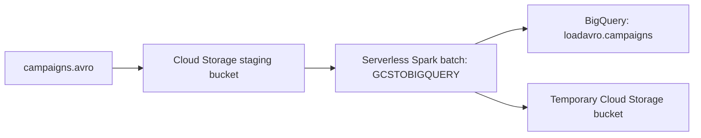

# Use Serverless for Apache Spark to Load BigQuery

## Files and how to use them

- [run-lab.sh](run-lab.sh): reusable Bash commands with separate `setup`, `run`, and `verify` modes.
- This README: complete lab procedure, configuration, expected output, and study explanations.

The original text file is retained locally as your source. The long terminal login, archive extraction listing, duplicated commands, and download progress are summarized rather than reproduced. The substantive four tasks and example results are retained below. Replace `YOUR_PROJECT_ID` with the active training project.

### Run the script in the correct terminal

1. Upload `run-lab.sh` to Cloud Shell and run:

```bash
bash run-lab.sh setup YOUR_PROJECT_ID
```

2. Open **Compute Engine**, find `lab-vm`, and select **SSH**. Upload the script there. From a fresh working directory, run:

```bash
bash /path/to/run-lab.sh run YOUR_PROJECT_ID
```

3. After the batch succeeds, verify from the VM or Cloud Shell where the script is available:

```bash
bash /path/to/run-lab.sh verify YOUR_PROJECT_ID
```

The `setup` mode creates resources and is intended for a fresh lab. Rerunning it may fail if the buckets or dataset already exist. The `run` mode uses the source lab’s **overwrite** setting for `loadavro.campaigns`. `verify` only queries the table.

### Configuration

| Variable | Default | Purpose |
| --- | --- | --- |
| `GCP_PROJECT` | Required script argument | Active lab project. |
| `REGION` | `us-east1` | Subnet update and Spark execution region. |
| `STAGING_BUCKET` | Project ID | Stores the Avro input and staging assets. |
| `TEMP_BUCKET` | Project ID plus `-bqtemp` | Temporary bucket for the BigQuery write. |
| `DATASET` | `loadavro` | Destination dataset. |
| `TABLE` | `campaigns` | Destination table. |
| `JARS` | Connector URI from the supplied lab | Spark BigQuery connector used by the lab template. |

For another bucket name, export `STAGING_BUCKET` and `TEMP_BUCKET` before running the script. The input location intentionally follows the source lab’s bucket-level URI; keep unrelated files out of this training staging bucket. The connector and template URLs are preserved from your notes, rather than updated to another version.

## Overview
Serverless for Apache Spark is a fully-managed service that makes it easier to run open source data processing and analytics workloads without the need to manage infrastructure or manually tune workloads.

Serverless for Spark provides an optimized environment designed to easily move existing Spark workloads to Google Cloud.

In this lab you will run a Batch workload on the Serverless for Apache Spark environment. The workload will use a template to process an Avro file to create and load a BigQuery table.

## Learning objectives
Configure the environment
Download lab assets
Configure and execute the Spark code
View data in BigQuery

## Task 1. Complete environment configuration tasks
First, you're going to perform a few environment configuration tasks to support the execution of a Serverless for Apache Spark workload.

In the Cloud Shell, run the following command to enable Private IP Access:

```bash
gcloud compute networks subnets update default --region=us-east1 --enable-private-ip-google-access
```
Use the following command to create a new Cloud Storage bucket as a staging location:

```bash
gsutil mb -p  YOUR_PROJECT_ID gs://YOUR_PROJECT_ID
```
Use the following command to create a new Cloud Storage bucket as temporary location for BigQuery while it creates and loads a table:

```bash
gsutil mb -p  YOUR_PROJECT_ID gs://YOUR_PROJECT_ID-bqtemp
```
Create a BQ dataset to store the data.

```bash
bq mk -d  loadavro
```


## Task 2. Download lab assets
Next, you're going to download a few assets necessary to complete the lab into lab provided Compute Engine VM. You will perform the rest of the steps in the lab inside the Compute Engine VM.

From the Navigation menu click on Compute Engine. Here you'll see a linux VM provisioned for you. Click the SSH button next to the lab-vm instance.

At the VM terminal prompt, download the Avro file that will be processed for storage in BigQuery.

```bash
wget https://storage.googleapis.com/cloud-training/dataengineering/lab_assets/idegc/campaigns.avro
```
Next, move the Avro file to the staging Cloud Storage bucket you created earlier.

```bash
gcloud storage cp campaigns.avro gs://YOUR_PROJECT_ID
```
Download an archive containing the Spark code to be executed against the Serverless environment.

```bash
wget https://storage.googleapis.com/cloud-training/dataengineering/lab_assets/idegc/dataproc-templates.zip
```
Extract the archive.

```bash
unzip dataproc-templates.zip
```
Change to the Python directory.

```bash
cd dataproc-templates/python
```

## Task 3. Configure and execute the Spark code
Next, you're going to set a few environment variables into VM instance terminal and execute a Spark template to load data into BigQuery.

Set the following environment variables for the Serverless for Apache Spark environment.

```bash
export GCP_PROJECT=YOUR_PROJECT_ID
```

```bash
export REGION=us-east1
```

```bash
export GCS_STAGING_LOCATION=gs://YOUR_PROJECT_ID
```

```bash
export JARS=gs://cloud-training/dataengineering/lab_assets/idegc/spark-bigquery_2.12-20221021-2134.jar
```
Run the following code to execute the Spark Cloud Storage to BigQuery template to load the Avro file in to BigQuery.

```bash
./bin/start.sh \
-- --template=GCSTOBIGQUERY \
    --gcs.bigquery.input.format="avro" \
    --gcs.bigquery.input.location="gs://YOUR_PROJECT_ID" \
    --gcs.bigquery.input.inferschema="true" \
    --gcs.bigquery.output.dataset="loadavro" \
    --gcs.bigquery.output.table="campaigns" \
    --gcs.bigquery.output.mode=overwrite\
    --gcs.bigquery.temp.bucket.name="YOUR_PROJECT_ID-bqtemp"
```

## Task 4. Confirm that the data was loaded into BigQuery
Now that you have successfully executed the Spark template, it is time to examine the results in BigQuery.

View the data in the new table in BigQuery.

```bash
bq query \
 --use_legacy_sql=false \
 'SELECT * FROM `loadavro.campaigns`;'
```
The query should return results similiar to the following:
Example output:

```text
+------------+--------+---------------------+--------+---------------------+----------+-----+
| created_at | period |    campaign_name    | amount | advertising_channel | bid_type | id  |
+------------+--------+---------------------+--------+---------------------+----------+-----+

| 2020-09-17 |     90 | NA - Video - Other  |     41 | Video               | CPC      |  81 |
| 2021-01-19 |     30 | NA - Video - Promo  |    325 | Video               | CPC      | 137 |
| 2021-06-28 |     30 | NA - Video - Promo  |     78 | Video               | CPC      | 214 |
| 2021-03-15 |     30 | EU - Search - Brand |    465 | Search              | CPC      | 170 |
| 2022-01-01 |     30 | EU - Search - Brand |     83 | Search              | CPC      | 276 |
| 2020-02-18 |     30 | EU - Search - Brand |     30 | Search              | CPC      |  25 |
| 2021-06-08 |     30 | EU - Search - Brand |    172 | Search              | CPC      | 201 |
| 2020-11-29 |     60 | EU - Search - Other |     83 | Search              | CPC      | 115 |
| 2021-09-11 |     30 | EU - Search - Other |     86 | Search              | CPC      | 237 |
| 2022-02-17 |     30 | EU - Search - Other |     64 | Search              | CPC      | 296 |
+------------+--------+---------------------+--------+---------------------+----------+-----+
```

## Understand the data flow



The VM is where you download the template and submit the workload. The submitted batch performs the processing in Serverless for Apache Spark. The template reads Avro from Cloud Storage and writes a BigQuery table. This produces loaded BigQuery data, unlike a BigQuery external table that continues to query files in place.

### Why each step matters

- Private Google Access is enabled on the lab’s default subnet before submitting the workload.
- The staging bucket receives the Avro file and is supplied to the template launcher.
- The temporary bucket is passed separately for the BigQuery write process.
- `GCSTOBIGQUERY` chooses the Cloud Storage-to-BigQuery template.
- `avro` tells the template the input format.
- `inferschema=true` requests schema inference.
- `overwrite` replaces the destination table data during the write.

### What your captured session shows

Your transcript records downloads of the Avro and template archive, the upload to the staging bucket, template execution, and a query returning campaign records. The example result above contains ten displayed rows. It is evidence from the supplied session, not a guarantee of the total row count in another run. The original query has no `ORDER BY`, so display order can vary.

## Verification checklist

- [ ] Correct Google Cloud project selected.
- [ ] Private Google Access enabled for the lab subnet in `us-east1`.
- [ ] Staging bucket, temporary bucket, and `loadavro` dataset created.
- [ ] Assets downloaded on `lab-vm` and `campaigns.avro` uploaded to staging.
- [ ] Template executed from `dataproc-templates/python`.
- [ ] Destination `loadavro.campaigns` is queryable.
- [ ] Output columns include `created_at`, `period`, `campaign_name`, `amount`, `advertising_channel`, `bid_type`, and `id`.

## Troubleshooting

| Symptom | Checks |
| --- | --- |
| Bucket creation fails | Globally unique bucket names, project permissions, and whether the bucket already exists. |
| Dataset already exists | Skip the completed setup step rather than recreating the dataset. |
| `start.sh` cannot be found | Working directory is `dataproc-templates/python` and extraction completed. |
| Batch submission or storage access fails | Selected project, region, network configuration, and execution account permissions. |
| Connector or template download fails | Availability of the lab asset URLs and network access. |
| BigQuery table missing | Batch completion status, destination project/dataset/table, and error output. |
| Script rejects an existing asset directory | Start `run` in a fresh directory; the guard avoids mixing extracted assets from different runs. |

## Review questions

1. **Does the lab VM process the whole batch?** It is the submission environment; the workload runs in Serverless Spark.
2. **What format is the source data?** Avro.
3. **What selects the transfer template?** `--template=GCSTOBIGQUERY`.
4. **Why are there two bucket settings?** One supplies staging/input storage; the other is passed for temporary BigQuery write storage.
5. **What does overwrite mean?** The destination write replaces existing table data.
6. **How do you confirm the load?** Query `loadavro.campaigns` and inspect the returned columns and records.

## Source and validation

Organized from `Use Serverless for Apache Spark.txt`. Script commands preserve the lab’s asset URLs and template settings, with reusable project variables and separate terminal phases. The script was prepared for study and reuse; no cloud resources were created or Spark jobs submitted while organizing these files.
