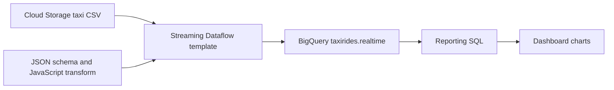

# Streaming Data Pipeline for a Real-Time Dashboard with Dataflow

## Files and quick start

- [run-lab.sh](run-lab.sh): reusable Cloud Shell commands for dataset/table setup, copying artifacts, and previewing rows.
- This README: all eight lab tasks, original reporting SQL, dashboard settings, and study notes.

The source `.txt` is retained locally. The duplicated dashboard data-source metadata and repeated SQL are omitted here; the query itself remains in Task 5. Temporary project and bucket identifiers are replaced with `YOUR_PROJECT_ID` and `YOUR_BUCKET`.

Use your current lab project and the bucket provisioned for it. Run the script in Cloud Shell:

```bash
bash run-lab.sh setup YOUR_PROJECT_ID YOUR_BUCKET
bash run-lab.sh artifacts YOUR_PROJECT_ID YOUR_BUCKET
```

Then create the Dataflow job manually using Task 3. Once rows arrive:

```bash
bash run-lab.sh preview YOUR_PROJECT_ID YOUR_BUCKET
```

Setup is intended for a fresh lab and may stop if the dataset or table already exists. The script does not launch or cancel a Dataflow job or create a dashboard. Those steps remain explicit in the guide.

## Configuration reference

| Setting | Lab value |
| --- | --- |
| Region and BigQuery dataset location | `us-central1` |
| Dataset/table | `taxirides.realtime` |
| Partition field | `timestamp` |
| Dataflow job name | `streaming-taxi-pipeline` |
| Template | Cloud Storage Text to BigQuery (Stream) |
| Input | `gs://YOUR_BUCKET/tmp/rt_taxidata.csv` |
| Schema | `gs://YOUR_BUCKET/tmp/schema.json` |
| JavaScript UDF | `gs://YOUR_BUCKET/tmp/transform.js` |
| UDF function name | `transform` |
| Output table parameter | `YOUR_PROJECT_ID:taxirides.realtime` |
| Temporary directories | `gs://YOUR_BUCKET/tmp` |
| Initial/max workers | `1` / `2` |
| Machine type recorded in the lab | `e2-medium` |

The notes call the dashboard product Data Studio; labels may differ in your console. Follow the matching BigQuery connector and chart controls. The script enables the Dataflow API without disabling it first. Task 3 retains the original lab’s disable/enable sequence as reference; it is not needed merely to enable an already available API.

## Overview
In this lab, you own a fleet of New York City taxi cabs and are looking to monitor how well your business is doing in real-time. You build a streaming data pipeline to capture taxi revenue, passenger count, ride status, and much more, and then visualize the results in a management dashboard.


## Objectives
In this lab you learn how to:

Create a Dataflow job from a template
Stream a Dataflow pipeline into BigQuery
Monitor a Dataflow pipeline in BigQuery
Analyze results with SQL
Visualize key metrics in Data Studio

## Task 1. Create a BigQuery dataset
In this task, you create the taxirides dataset. You have two different options which you can use to create this, using the Google Cloud Shell or the Google Cloud Console.

In this lab you will be using an extract of the NYC Taxi & Limousine Commission’s open dataset. A small, comma-separated, datafile will be used to simulate periodic updates of taxi data.

BigQuery is a serverless data warehouse. Tables in BigQuery are organized into datasets. In this lab, taxi data will flow from the standalone file via Dataflow to be stored in BigQuery. With this configuration, any new datafile deposited into the source Cloud Storage bucket would automatically be processed for loading.

Use one of the following options to create a new BigQuery dataset:

Option 1: The command-line tool
In Cloud Shell (Cloud Shell icon), run the following command to create the taxirides dataset.
```bash
bq --location=us-central1 mk taxirides
```
Run this command to create the taxirides.realtime table (empty schema that you will stream into later).
```bash
bq --location=us-central1 mk \
--time_partitioning_field timestamp \
--schema ride_id:string,point_idx:integer,latitude:float,longitude:float,\
timestamp:timestamp,meter_reading:float,meter_increment:float,ride_status:string,\
passenger_count:integer -t taxirides.realtime
```
Option 2: The BigQuery Console UI
Note: Skip these steps if you created the tables using the command line.
In the Google Cloud console, in the Navigation menu(Navigation Menu), click BigQuery.

If you see the Welcome dialog, click Done.

Click on View actions (View Actions) next to your Project ID, and then click Create dataset.

In Dataset ID, type taxirides.

In Data location, select:

us-central1
then click Create Dataset.

In the Explorer pane, click expand node (Expander) to reveal the new taxirides dataset.

Click on View actions (View Actions) next to the taxirides dataset, and then click Open.

Click Create Table.

In Table, type realtime

For the schema, click Edit as text and paste in the following:

```text
ride_id:string,
point_idx:integer,
latitude:float,
longitude:float,
timestamp:timestamp,
meter_reading:float,
meter_increment:float,
ride_status:string,
passenger_count:integer
```
In Partition and cluster settings, select timestamp.

Click Create Table.

## Task 2. Copy required lab artifacts
In this task, you move the required files to your Project.

Cloud Storage allows world-wide storage and retrieval of any amount of data at any time. You can use Cloud Storage for a range of scenarios including serving website content, storing data for archival and disaster recovery, or distributing large data objects to users via direct download.

A Cloud Storage bucket was created for you during lab start up.

In Cloud Shell (Cloud Shell icon), run the following commands to move files needed for the Dataflow job.
```bash
gcloud storage cp gs://cloud-training/bdml/taxisrcdata/schema.json  gs://YOUR_BUCKET/tmp/schema.json
```
```bash
gcloud storage cp gs://cloud-training/bdml/taxisrcdata/transform.js  gs://YOUR_BUCKET/tmp/transform.js
```
```bash
gcloud storage cp gs://cloud-training/bdml/taxisrcdata/rt_taxidata.csv  gs://YOUR_BUCKET/tmp/rt_taxidata.csv
```


## Task 3. Set up a Dataflow Pipeline
In this task, you set up a streaming data pipeline to read files from your Cloud Storage bucket and write data to BigQuery.

Dataflow is a serverless way to carry out data analysis.

Restart the connection to the Dataflow API.
In the Cloud Shell, run the following commands to ensure that the Dataflow API is enabled cleanly in your project.
```bash
gcloud services disable dataflow.googleapis.com
```
```bash
gcloud services enable dataflow.googleapis.com
```
Create a new streaming pipeline:
In the Cloud console, in the Navigation menu (Navigation Menu), click View all Products > Analytics > Dataflow.

In the top menu bar, click Create Job From Template.

Type streaming-taxi-pipeline as the Job name for your Dataflow job.

In Regional endpoint, select

us-central1
In Dataflow template, select the Cloud Storage Text to Bigquery (Stream) template under Process Data Continuously (stream).
Note: Make sure to select the template option which matches with the parameters listed below.
In Cloud Storage Input File(s), paste or type:
gs://YOUR_BUCKET/tmp/rt_taxidata.csv
In Cloud Storage location of your BigQuery schema file, described as a JSON, paste or type:
gs://YOUR_BUCKET/tmp/schema.json
In BigQuery Output table, paste or type:
YOUR_PROJECT_ID:taxirides.realtime
In Temporary directory for BigQuery loading process, paste or type:
gs://YOUR_BUCKET/tmp
Click Required Parameters.

In Temporary location, used for writing temporary files, paste or type:

gs://YOUR_BUCKET/tmp
In JavaScript UDF path in Cloud Storage, paste or type:
gs://YOUR_BUCKET/tmp/transform.js
In JavaScript UDF name, paste or type:
transform
In Max workers, type 2

In Number of workers, type 1

Uncheck Use default machine type.

Under General purpose, choose the following:

Series: E2
Machine type: e2-medium (2 vCPU, 4 GB memory)

Click Run Job.
Dataflow Template

A new streaming job has started! You can now see a visual representation of the data pipeline. It will take 3 to 5 minutes for data to begin moving into BigQuery.

## Task 4. Analyze the taxi data using BigQuery
In this task, you analyze the data as it is streaming.

In the Cloud console, in the Navigation menu (Navigation Menu), click BigQuery.

If the Welcome dialog appears, click Done.

In the Query Editor, type the following, and then click Run:

```sql
SELECT * FROM taxirides.realtime LIMIT 10;
```

## Task 5. Perform aggregations on the stream for reporting
In this task, you calculate aggregations on the stream for reporting.

In the Query Editor, clear the current query.

Copy and paste the following query, and then click Run.

```sql
WITH streaming_data AS (

SELECT
  timestamp,
  TIMESTAMP_TRUNC(timestamp, HOUR, 'UTC') AS hour,
  TIMESTAMP_TRUNC(timestamp, MINUTE, 'UTC') AS minute,
  TIMESTAMP_TRUNC(timestamp, SECOND, 'UTC') AS second,
  ride_id,
  latitude,
  longitude,
  meter_reading,
  ride_status,
  passenger_count
FROM
  taxirides.realtime
ORDER BY timestamp DESC
LIMIT 1000

)

# calculate aggregations on stream for reporting:
SELECT
 ROW_NUMBER() OVER() AS dashboard_sort,
 minute,
 COUNT(DISTINCT ride_id) AS total_rides,
 SUM(meter_reading) AS total_revenue,
 SUM(passenger_count) AS total_passengers
FROM streaming_data
GROUP BY minute, timestamp;
```
Note: Ensure Dataflow is registering data in BigQuery before proceeding to the next task.
The result shows key metrics by the minute for every taxi drop-off.

Click Save > Save query.

In the Save query dialog, in the Name field, type My Saved Query.

In Region, ensure that the region matches the Google Skills Lab Region.

Click Save.

## Task 6. Stop the Dataflow Job
In this task, you stop the Dataflow job to free up resources for your project.

In the Cloud console, in the Navigation menu (Navigation Menu), click View all Products > Analytics > Dataflow.

Click the streaming-taxi-pipeline, or the new job name.

Click Stop, and then select Cancel > Stop Job.


## Task 7. Create a real-time dashboard
In this task, you create a real-time dashboard to visualize the data.

In the Cloud console, in the Navigation menu (Navigation Menu), click BigQuery.

In the Explorer Pane, expand your Project ID.

Expand Queries, and then click My Saved Query.

Your query is loaded in to the query editor.

Click Run.

In the Query results section, click Open in > Data Studio.

Data Studio Opens. Click Get started.

In the Data Studio window, click your bar chart.

(Bar Chart

The Chart pane appears.

Click Add a chart, and then select Combo chart.

Combo chart

In the Setup pane, in Data Range Dimension, hover over minute (Date) and click X to remove it.

In the Data pane, click dashboard_sort and drag it to Setup > Data Range Dimension > Add dimension.

In Setup > Dimension, click minute, and then select dashboard_sort.

In Setup > Metric, click dashboard_sort, and then select total_rides.

In Setup > Metric, click Record Count, and then select total_passengers.

In Setup > Metric, click Add metric, and then select total_revenue.

In Setup > Sort, click total_rides, and then select dashboard_sort.

In Setup > Sort, click Ascending.

Your chart should look similar to this:

Sample chart

Note: Visualizing data at a minute-level granularity is currently not supported in Data Studio as a timestamp. This is why we created our own dashboard_sort dimension.
When you're happy with your dashboard, click Save and share to save this data source.

If prompted to complete your account setup, type your country and company details, agree to the terms and conditions, and then click Continue.

If prompted which updates you want to receive, answer no to all, then click Continue.

If prompted with the Review data access before saving window, click Acknowledge and save.

If prompted to choose an account select your Student Account.

Whenever anyone visits your dashboard, it will be up-to-date with the latest transactions. You can try it yourself by clicking More options (More Options), and then Refresh data.

## Task 8. Create a time series dashboard
In this task, you create a time series chart.

Click this Data Studio link to open Data Studio in a new browser tab.

On the Reports page, in the Start with a Template section, click the [+] Blank Report template.

A new, empty report opens with the Add data to report window.

From the list of Google Connectors, select the BigQuery tile.

Click Custom Query, and then select your ProjectID. This should appear in the following format, qwiklabs-gcp-xxxxxxx.

In Enter Custom Query, paste the following query:

```sql
SELECT
  *
FROM
  taxirides.realtime
WHERE
  ride_status='enroute';
```
Click Add > Add To Report.

A new untitled report appears. It may take up to a minute for the screen to finish refreshing.

Create a time series chart
In the Data pane, click Add a Field > Add calculated field.

Click All Fields on the left corner.

Change the timestamp field type to Date & Time > Date Hour Minute (YYYYMMDDhhmm).

In the change timestamp dialog, click Continue, and then click Done.

In the top menu, click Add a chart.

Choose Time series chart.

Time Series

Position the chart in the bottom left corner - in the blank space.

In Setup > Dimension, click timestamp (Date), and then select timestamp.

In Setup > Dimension, click timestamp, and then select calendar. Calendar

In Data Type, select Date & Time > Date Hour Minute.

Click outside the dialog to close it. You do not need to add a name.

In Setup > Metric, click Record Count, and then select meter reading.

## Understand the pipeline



The input file supplies simulated taxi observations. The JavaScript UDF transforms input records, and the schema describes the BigQuery destination fields. Dataflow writes records into the table; the dashboard queries BigQuery rather than querying Dataflow directly. The lab does not use a Pub/Sub input.

The table is partitioned on `timestamp`. Partitioning and grouping serve different purposes: partitioning organizes stored data, while the reporting query groups selected observations into results.

## Read the reporting SQL critically

Task 5 preserves the original lab query so you can reproduce the exercise. Its behavior has practical limits:

- The common table expression selects the latest **1,000 observations**, not the complete history.
- `TIMESTAMP_TRUNC(..., MINUTE, 'UTC')` produces a minute value, but the final `GROUP BY minute, timestamp` also groups by the original timestamp. Multiple result groups can therefore exist within one minute.
- `COUNT(DISTINCT ride_id)` counts distinct rides in each selected group, not necessarily completed rides.
- `SUM(meter_reading)` sums meter observations. If a ride appears repeatedly, this is not automatically business revenue.
- `SUM(passenger_count)` can similarly count the same passengers repeatedly across ride observations.
- `ROW_NUMBER() OVER()` has no specified ordering, so `dashboard_sort` is not a dependable chronological ordering key across refreshes.
- The query has no drop-off filter, despite the source notes describing drop-off metrics.

For a real business dashboard, first define the event meaning, deduplication rules, and revenue calculation. The source includes `meter_increment`, but does not establish whether summing that field is the correct business rule. Do not infer a revenue definition from the column name alone.

Task 8 filters `ride_status='enroute'`, so its chart covers that status rather than all ride statuses. Document whether the chart aggregates meter readings by sum, average, or another operation; the notes do not specify that aggregation setting.

## What happens after stopping the job?

Task 6 cancels the streaming job before the dashboard tasks. The dashboard can still query already loaded BigQuery records, but new ingestion from that job stops. Refreshing the report does not restart ingestion. Treat the lab’s “real-time” description in that context: fresh data requires a running ingestion pipeline and report refresh behavior that exposes it.

## Verification checklist

- [ ] Correct project, bucket, and `us-central1` region selected.
- [ ] `taxirides.realtime` exists with all nine fields and timestamp partitioning.
- [ ] Schema, transform, and CSV files exist under the bucket’s `tmp/` prefix.
- [ ] Streaming template parameters include the `gs://` prefix for storage paths.
- [ ] The UDF name is `transform`.
- [ ] Job starts and rows appear in the preview query.
- [ ] Task 5 query runs and is saved as `My Saved Query`.
- [ ] Combo chart uses the recorded dimensions and metrics.
- [ ] Time series uses the `enroute` query and timestamp field.
- [ ] Training job is stopped when required by the lab.

## Troubleshooting

| Symptom | Checks |
| --- | --- |
| Dataset/table already exists | Skip the completed setup step; do not delete existing data to rerun the exercise. |
| Template cannot read assets | Correct bucket, object paths, `gs://` prefix, and execution account permissions. |
| UDF error | UDF file is copied correctly and function name matches `transform`. |
| No rows in BigQuery | Job state/errors, selected input file, output project/table, and startup time. The lab suggests allowing 3–5 minutes. |
| Reporting metrics look inflated | Repeated observations, aggregation grain, selected statuses, and the 1,000-row limit. |
| Dashboard stops changing | Job was canceled, source has no new data, or report data has not refreshed. |
| Chart order changes | The original `ROW_NUMBER()` has no ordering clause. |

## Review questions

1. **What are the three copied assets?** The CSV data, JSON schema, and JavaScript transform.
2. **Where does the dashboard read from?** BigQuery.
3. **Does truncating a timestamp alone guarantee one result row per minute?** No; the final grouping keys determine the result grain.
4. **Why might passenger totals be overstated?** A passenger count may repeat across observations of the same ride.
5. **Does canceling Dataflow delete the BigQuery table?** No; the cancellation stops that job’s ingestion.
6. **Does report refresh restart Dataflow?** No.

## Source and validation

Organized from `Creating a Streaming Data Pipeline.txt`. All eight tasks and substantive SQL are retained, with reusable identifiers and fenced commands. Explanations and review questions are study aids. No cloud commands or queries were executed while organizing these files.
